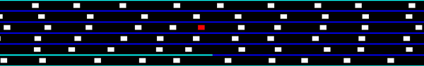

# About The Project
This is a framework for creating simple traffic environment simulations. Here is an example simulation (red is the agent):

<!--- () --->

# Requirements
numpy, gymnasium, cv2

# Usage
Overwrite **BaseSpawner** and **BaseTrafficEnvironment** classes in **TrafficEnvironments\base_models.py** to create your own custom environments. Read the documentation in **BaseTrafficEnvironment** to see how. You can also see the example **TrafficEnvironments\traffic_env.py**.

# Contact
kaan.buyukdemirci@ug.bilkent.edu.tr, kaanbuyukdemirci2023@gmail.com

# License

# TODO
* Better documentation
* Parallel computation
* Profiling
* Using continuous y-axis locations instead of digital lanes
* A separate log window